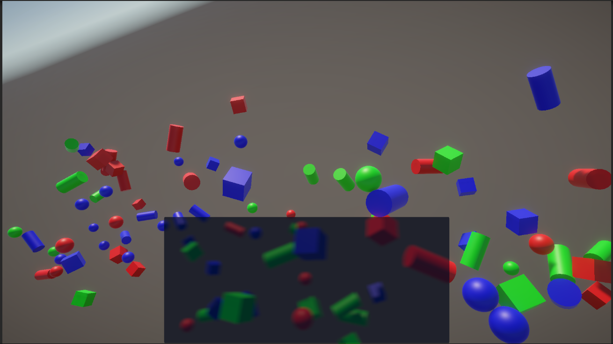

# Unity URP TranslucentUI Shader
 

The `TranslucentUIShader` is a custom shader designed for creating translucent UI elements in Unity. It supports various features such as blur effects, stencil operations, and color masking. This shader requires the Opaque Texture option to be enabled in camera or render settings. Shader uses the scene texture for rendering.

## Features

- **Main Texture**: The primary texture for the UI element.
- **Color Tint**: A color tint applied to the UI element.
- **Blur Size**: Controls the size of the blur effect.
- **Blur Radius**: Controls the radius of the blur effect.
- **Transparency Toggle**: A toggle to enable or disable transparency.
- **Stencil Operations**: Supports stencil comparison, ID, operation, write mask, and read mask.
- **Color Mask**: Controls which color channels are affected by rendering.

## Properties

- `_MainTex`: The main texture of the UI element.
- `_Color`: The color tint applied to the UI element.
- `_BlurSize`: The size of the blur effect.
- `_BlurRadius`: The radius of the blur effect.
- `_IS_TRANSPARENT`: Toggle for enabling/disabling transparency.

## Usage

1. **Assign the Shader**: Create a new material and assign the `TranslucentUIShader` to it.
2. **Set Properties**: Adjust the properties in the material inspector to achieve the desired effect.
3. **Apply Material**: Apply the material to your UI elements.

## Shader Code
The shader code is located in Assets/Shaders/TranslucentUIShader.shader. For more details, refer to the shader code in the project.